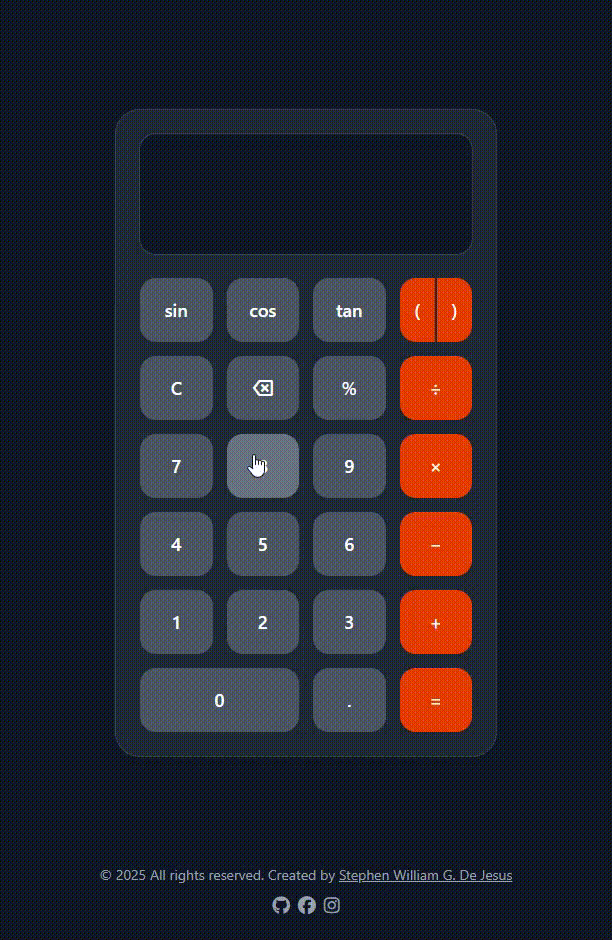
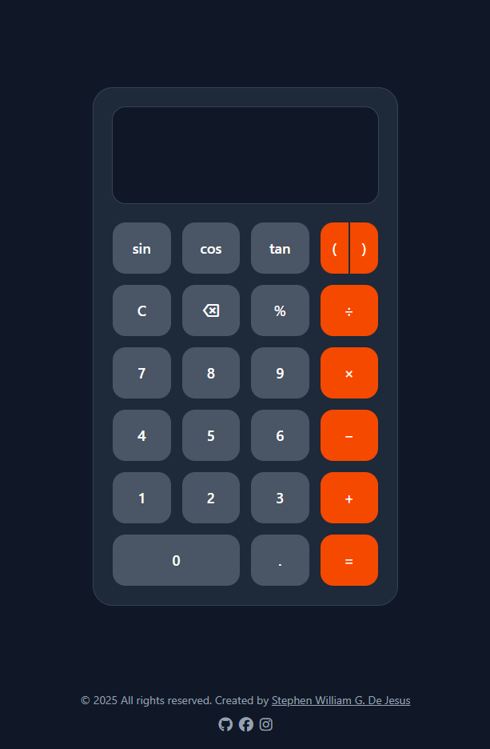

# 🧮 Multi Operand Calculator – Advanced Mathematical Tool

A powerful and intuitive scientific calculator built with **HTML5**, **Tailwind CSS**, **JavaScript**, and **Math.js**.  
Perform complex mathematical expressions including trigonometric functions, parentheses, and multi-step calculations with a modern dark theme interface.

Crafted by **[Stephen William G. De Jesus](https://www.facebook.com/stephenwilliam.dejesus.5/)**, this project demonstrates advanced mathematical computation, expression parsing, and responsive scientific calculator design.

---

## 📸 Preview  

### 🎞️ Live Interaction (GIF)  


### 🖼️ Application Screenshot  


---

## 🌐 Live Demo  
[View Live Demo](https://bogiiiie.github.io/17-javascript-multiple-operand-calculator-/)

---

## ✨ Features

- 🔬 **Scientific Functions** – Sine, cosine, tangent trigonometric operations
- 🧮 **Complex Expressions** – Multi-step calculations with proper order of operations
- 📐 **Parentheses Support** – Nested expressions with automatic grouping
- 📱 **Large Display Area** – Scrollable textarea for long expressions
- ⌫ **Smart Backspace** – Remove characters while maintaining expression integrity
- 🔄 **Continuous Calculations** – Use results in subsequent calculations
- 🚫 **Error Handling** – Robust error detection with clear error messages
- 📱 **Fully Responsive** – Optimized for desktop, tablet, and mobile devices
- ♿ **Accessibility Ready** – ARIA labels, semantic HTML, and keyboard navigation
- 🎨 **Modern Dark Theme** – Professional gray design with orange operation highlights
- ⚡ **Math.js Integration** – Reliable mathematical expression evaluation
- 🎯 **Smart Input Logic** – Automatic parentheses insertion for operators

---

## 🖥️ How to Use

### Basic Operations
1. **Enter Numbers** – Click digit buttons (0-9) to input numbers
2. **Select Operations** – Choose from +, −, ×, ÷, % operations
3. **Calculate Result** – Press "=" to evaluate the entire expression
4. **Continue Calculations** – Use the result for further operations

### Advanced Functions
- **Trigonometry** – Use sin, cos, tan functions (input in radians)
- **Parentheses** – Group operations with ( and ) buttons
- **Complex Expressions** – Build multi-step calculations like: `sin(45) + (2 * 3)`
- **Error Recovery** – Clear errors with "C" button and start fresh

### Special Functions
- **C** – Clear all and reset calculator
- **⌫** – Backspace (remove last character/function)
- **.** – Add decimal point for floating numbers

---

## 🧮 Supported Operations & Functions

### Arithmetic Operations
```
Addition       (+)    Example: 5 + 3 = 8
Subtraction    (−)    Example: 10 − 4 = 6
Multiplication (×)    Example: 7 × 8 = 56
Division       (÷)    Example: 15 ÷ 3 = 5
Modulus        (%)    Example: 10 % 3 = 1
```

### Trigonometric Functions
```
Sine           sin()  Example: sin(1.57) ≈ 1
Cosine         cos()  Example: cos(0) = 1
Tangent        tan()  Example: tan(0.785) ≈ 1
```

### Complex Expressions
```
Nested Operations:  (2 + 3) × (4 − 1) = 15
Mixed Functions:    sin(1) + cos(0) × 2 ≈ 2.841
Chained Calc:       ((5 + 3) ÷ 2) × 6 = 24
```

---

## 🛠️ Built With

- [HTML5](https://developer.mozilla.org/en-US/docs/Web/Guide/HTML/HTML5) – Semantic structure with ARIA accessibility
- [Tailwind CSS](https://tailwindcss.com/) – Utility-first styling and responsive grid system
- [JavaScript ES6+](https://developer.mozilla.org/en-US/docs/Web/JavaScript) – Expression handling and DOM manipulation  
- [Math.js 11.8.0](https://mathjs.org/) – Advanced mathematical expression evaluation
- [Font Awesome 6.5.2](https://fontawesome.com/) – Social media icons
- [Google Material Icons](https://fonts.google.com/icons) – Backspace and UI symbols

---

## 📁 Project Structure

```
17-javascript-multiple-operand-calculator/
├── index.html          # Main HTML structure
├── script.js           # JavaScript calculation logic
├── output.css          # Tailwind CSS compiled styles
└── images/
    ├── demo.gif        # Live interaction demo
    └── demo.png        # Application screenshot
```

---

## 🚀 Getting Started

To run this project locally:

```bash
git clone https://github.com/bogiiiie/17-javascript-multiple-operand-calculator.git
cd 17-javascript-multiple-operand-calculator
open index.html
```

**Requirements:** Modern web browser with JavaScript enabled and internet connection for Math.js CDN.

---

## 🎯 Core Functions

### Expression Management
- `addExpression(button)` – Appends button values to expression string
- `calculateResult()` – Evaluates complete expression using Math.js
- `backspace()` – Removes last character from both display and expression
- `reset()` – Clears all calculator state and display

### Smart Input Logic
```javascript
// Automatic parentheses insertion for operators
if (value == `-` || value == `+`) {
    if(isNaN(lastCharacterInExpression) && lastCharacterInExpression != `(`) {
        value = `(${value}`;
    }
}
```

### Math.js Integration
```javascript
try {
    result = math.evaluate(expression);
    expression = result.toString();
} catch {
    result = `Error`;
    expression = ``;
}
```

### State Variables
```javascript
let expression = ``;        // Current mathematical expression
let result;                 // Calculated result
const calculatorScreenDisplay; // Display element reference
```

---

## ♿ Accessibility Features

- 🏷️ **ARIA Labels** – Descriptive labels for all buttons and functions
- 📢 **Semantic HTML** – Proper button roles and form structure
- ⌨️ **Keyboard Navigation** – Full tab-through functionality
- 📱 **Touch Targets** – Large 64px buttons for mobile interaction
- 🎯 **Focus Management** – Clear focus indicators on all interactive elements
- 🔊 **Screen Reader Support** – Meaningful button descriptions
- 📜 **Scrollable Display** – Auto-scroll for long expressions

---

## 📱 Responsive Design

### Layout Specifications
- **Container:** Fixed max-width of 380px for optimal usability
- **Button Grid:** 6×4 CSS Grid layout with 14px gaps
- **Display:** Full-width textarea with auto-scroll functionality
- **Button Arrangement:** Logical grouping of functions and operations

### Button Layout (6 rows × 4 columns)
```
Row 0: [sin] [cos] [tan] [(  )]
Row 1: [ C ] [ ⌫ ] [ % ] [ ÷ ]
Row 2: [ 7 ] [ 8 ] [ 9 ] [ × ]
Row 3: [ 4 ] [ 5 ] [ 6 ] [ − ]
Row 4: [ 1 ] [ 2 ] [ 3 ] [ + ]
Row 5: [  0    ] [ . ] [ = ]
```

---

## 🎨 Design System

### Color Palette
- **Background:** `bg-gray-900` – Dark primary background
- **Calculator Body:** `bg-gray-800` – Secondary container
- **Display Area:** `bg-gray-900` – Textarea background with ring border
- **Function Buttons:** `bg-gray-600` – Standard button color
- **Operation Buttons:** `bg-orange-600` – Highlighted operators
- **Text:** `text-white` – High contrast white text
- **Accent Border:** `ring-gray-700` – Subtle border highlights

### Interactive States
- **Hover:** Lighter shade with smooth transitions
- **Active:** Scale-down effect (`active:scale-95`) + color change
- **Focus:** Visible outline for keyboard navigation
- **Transitions:** 150ms smooth animations for all interactions

---

## ⚡ Math.js Integration Benefits

### Advanced Capabilities
- **Expression Parsing** – Handles complex mathematical syntax
- **Order of Operations** – Automatic PEMDAS/BODMAS compliance
- **Function Support** – Built-in trigonometric and mathematical functions
- **Error Handling** – Graceful failure with descriptive error messages
- **Precision** – High-accuracy floating-point calculations

### Supported Math.js Features
```javascript
// Basic arithmetic with parentheses
math.evaluate('(2 + 3) * 4')  // 20

// Trigonometric functions
math.evaluate('sin(pi/4)')    // 0.7071...

// Complex expressions
math.evaluate('sqrt(16) + cos(0) * 3')  // 7
```

---

## 🔗 Connect with Me

- 💻 **GitHub:** [@bogiiiie](https://github.com/bogiiiie)
- 📘 **Facebook:** [Stephen William De Jesus](https://www.facebook.com/stephenwilliam.dejesus.5/)
- 📷 **Instagram:** [@stephenwilliamdejesus](https://instagram.com/stephenwilliamdejesus)

---

## 👨‍💻 Author

Created by **Stephen William G. De Jesus**

---

## 📄 License

© 2025 All rights reserved. Created by Stephen William G. De Jesus.

---

## 🚀 Future Enhancements

- 📊 **More Scientific Functions** – Logarithms, exponentials, square roots
- 🧠 **Memory Functions** – M+, M-, MR, MC memory operations
- 📈 **Calculation History** – Save and recall previous calculations
- 📐 **Unit Conversions** – Length, weight, temperature converters
- 🎨 **Theme Customization** – Multiple color schemes and personalization
- ⌨️ **Keyboard Shortcuts** – Full keyboard input support
- 📱 **PWA Integration** – Offline functionality and app installation
- 🔊 **Audio Feedback** – Sound effects for button interactions
- 💾 **Expression Storage** – Save complex expressions for reuse
- 📊 **Graphing Capability** – Plot mathematical functions visually

---

## 🔥 Technical Specifications

| Feature | Implementation |
|---------|----------------|
| **Math Engine** | Math.js 11.8.0 for expression evaluation |
| **Function Types** | Arithmetic, Trigonometric, Parentheses |
| **Display Type** | Scrollable textarea with monospace font |
| **Expression Length** | Unlimited (limited by browser memory) |
| **Precision** | Double-precision floating-point |
| **Error Handling** | Try-catch with graceful error messages |
| **Button Layout** | 6×4 responsive grid (24 buttons total) |
| **Browser Support** | Modern browsers with ES6+ and CDN access |

---

## 🧪 Browser Compatibility

- ✅ **Chrome** 90+ (Full Math.js support)
- ✅ **Firefox** 88+ (Full functionality)
- ✅ **Safari** 14+ (Math.js CDN compatible)
- ✅ **Edge** 90+ (Complete feature set)
- ✅ **Mobile Browsers** (iOS Safari, Chrome Mobile)
- ⚠️ **Internet Explorer** Not supported (requires Math.js and modern CSS)

---

## 📋 Testing Checklist

- [ ] All number buttons (0-9) input correctly
- [ ] Basic arithmetic operations (+, −, ×, ÷, %) work
- [ ] Trigonometric functions (sin, cos, tan) calculate accurately
- [ ] Parentheses grouping works with nested expressions
- [ ] Backspace removes characters from display and expression
- [ ] Clear button resets all calculator state
- [ ] Error handling displays "Error" for invalid expressions
- [ ] Scrollable display handles long expressions
- [ ] Smart operator insertion adds parentheses when needed
- [ ] Responsive design works on all device sizes
- [ ] Accessibility features function properly
- [ ] Math.js CDN loads successfully

---

## 🔧 Troubleshooting

### Common Issues
- **Math.js not loading:** Check internet connection and CDN availability
- **Functions not working:** Ensure Math.js script loads before calculator script
- **Display issues:** Verify textarea element is properly referenced
- **Expression errors:** Check for mismatched parentheses or invalid syntax

### Performance Notes
- Math.js adds ~500KB to page load but provides robust calculation engine
- Expression evaluation is near-instantaneous for typical calculations
- Display scrolling is optimized for smooth user experience
